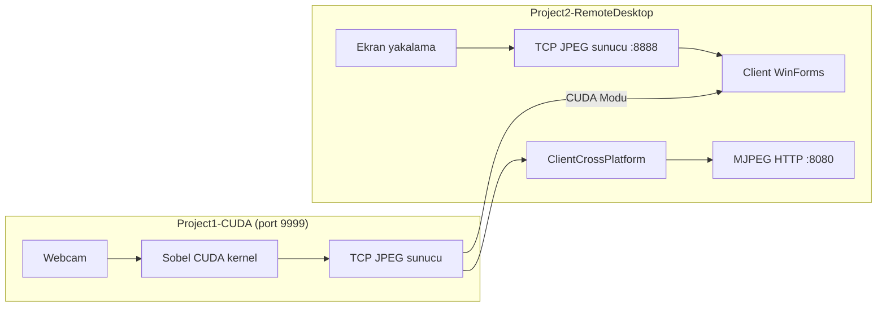

# Sistem Programlama Projesi

Bu depo, **sistem programlama** dersi kapsamında geliştirilen iki birbirini tamamlayan alt projeyi içerir:

| Alt proje | Teknoloji | Amaç |
|-----------|-----------|------|
| **Project1-CUDA** | C++/CUDA, OpenCV, Winsock | Webcam görüntüsünde GPU üzerinde Sobel kenar tespiti ve TCP ile yayın |
| **Project2-RemoteDesktop** | C# (.NET 8), WinForms | Ekran yakalama ve uzaktan görüntüleme; CUDA akışını da destekler |

Kaynak kodlar `sistem-programlama-proje/` dizinindedir.

## Genel mimari



**Ortak iletişim protokolü:** Her kare önce **4 bayt big-endian** JPEG boyutu, ardından JPEG verisi gönderilir. Bu format hem CUDA sunucusunda (`socket_server.cpp`) hem uzak masaüstü sunucusunda (`StreamServer.cs`) aynıdır.

---

## Project1-CUDA

Webcam’den alınan kareler gri tonlamaya çevrilir, **CUDA Sobel filtresi** ile kenar haritası üretilir; sonuç hem yerel pencerede gösterilir hem de TCP üzerinden istemcilere JPEG olarak aktarılır.

### Özellikler

- **GPU Sobel kenar tespiti** — `sobel_kernel` 16×16 thread bloklarıyla çalışır; gradyan büyüklüğü `sqrt(gx² + gy²)` ile hesaplanır.
- **Gerçek zamanlı FPS** — İşlenmiş kare üzerine OpenCV ile bindirilir.
- **TCP yayın (port 9999)** — Tek istemci; bağlantı koptuğunda yeniden kabul eder.
- **Thread-safe gönderim** — `frame_mutex` ile CUDA işlemi bitmeden soket gönderimi yapılmaz.

### Kaynak dosyalar

| Dosya | Açıklama |
|-------|----------|
| `src/main.cpp` | Ana uygulama: webcam, CUDA pipeline, görüntüleme, soket |
| `src/main.cu` | CUDA/OpenCV ortam doğrulama (cihaz sayısı, sürüm) |
| `src/kernel.cu` / `kernel.h` | `sobel_kernel` ve `apply_sobel()` |
| `src/socket_server.cpp` / `.h` | Winsock2 TCP sunucu, JPEG `imencode` |
| `CMakeLists.txt` | CUDA 17, OpenCV, `ws2_32` bağlantısı |
| `CMakePresets.json` | vcpkg + Visual Studio preset’leri |
| `vcpkg-opencv-kurulum.txt` | Windows’ta OpenCV kurulum adımları |

### Gereksinimler

- Windows (Winsock2 kullanımı)
- [NVIDIA CUDA Toolkit](https://developer.nvidia.com/cuda-downloads) (ör. 13.x)
- CMake ≥ 3.18
- Visual Studio 2022/2026 (x64)
- [vcpkg](https://github.com/microsoft/vcpkg) ile `opencv4:x64-windows`

OpenCV kurulumu için ayrıntılı adımlar: `sistem-programlama-proje/Project1-CUDA/vcpkg-opencv-kurulum.txt`

### Derleme

```powershell
cd sistem-programlama-proje/Project1-CUDA

# vcpkg yolunu kendi kurulumunuza göre düzenleyin
cmake --preset default
cmake --build build --config Release
```

Çıktı: `build/Release/main.exe` (veya Debug yapılandırmasına göre `build/Debug/main.exe`).

### Çalıştırma

```powershell
.\build\Release\main.exe
```

- Yerel pencerede kenar haritası görüntülenir.
- **Port 9999** üzerinden JPEG kare akışı başlar.
- Çıkmak için pencerede **`q`** tuşuna basın.

---

## Project2-RemoteDesktop

Windows ekranını JPEG olarak yakalayıp TCP ile ileten sunucu ve bu akışı (veya CUDA akışını) görüntüleyen istemcilerden oluşur.

### Bileşenler

| Proje | Tür | Port | Açıklama |
|-------|-----|------|----------|
| **Server** | Konsol (`net8.0-windows`) | **8888** | Birincil ekranın JPEG yakalaması ve TCP yayını |
| **Client** | WinForms (`net8.0-windows`) | — | IP/port ile bağlanır; **CUDA Modu** ile 9999’a geçer |
| **ClientCrossPlatform** | Konsol (`net8.0`) | TCP **9999**, HTTP **8080** | CUDA TCP akışını alır, tarayıcıda MJPEG olarak sunar |

### Özellikler

**Server**
- `ScreenCapture` — `CopyFromScreen` ile tam ekran, JPEG kalite ~70.
- `StreamServer` — İstemci bağlantısı kopunca yeniden dinler.

**Client (WinForms)**
- IP, port ve Bağlan / Bağlantıyı Kes.
- **CUDA Modu (port 9999)** — Project1 sunucusuna bağlanır.
- FPS sayacı ve `PictureBox` ile canlı önizleme.

**ClientCrossPlatform**
- CUDA sunucusundan TCP ile kare alır.
- `HttpStreamer` ile `http://localhost:8080/` üzerinde **MJPEG** (`multipart/x-mixed-replace`) yayınlar.
- macOS/Linux/Windows’ta .NET 8 ile çalışır (WinForms gerekmez).

### Gereksinimler

- .NET 8 SDK
- Windows (Server ve Client için; ekran yakalama ve WinForms)
- ClientCrossPlatform için yalnızca .NET 8 runtime yeterlidir

### Derleme ve çalıştırma

```bash
cd sistem-programlama-proje/Project2-RemoteDesktop
```

**1. Uzak masaüstü (klasik mod)**

```bash
# Sunucu — ekranı yayınlar
dotnet run --project Server

# İstemci — ayrı terminal/pencerede
dotnet run --project Client
# IP: sunucu makinesi, Port: 8888
```

**2. CUDA + tarayıcı (çapraz platform istemci)**

```bash
# Önce Project1 main.exe çalışıyor olmalı (port 9999)

# TCP → HTTP köprüsü
dotnet run --project ClientCrossPlatform
# Varsayılan: 127.0.0.1:9999 → http://localhost:8080/

# Özel host/port:
dotnet run --project ClientCrossPlatform -- 192.168.1.10 9999 8080
```

Tarayıcıda `http://localhost:8080/` adresini açın.

**3. CUDA + WinForms istemci**

```bash
dotnet run --project Client
```

Arayüzde **CUDA Modu (port 9999)** kutusunu işaretleyin ve Project1 sunucusunun IP’sine bağlanın.

---

## Senaryolar

### Senaryo A — Sadece CUDA kenar tespiti

1. `Project1-CUDA` → `main.exe`
2. İsteğe bağlı: `Client` (CUDA Modu) veya `ClientCrossPlatform` + tarayıcı

### Senaryo B — Uzak masaüstü

1. `Server` (8888)
2. `Client` → IP + port 8888

### Senaryo C — CUDA akışını tarayıcıda izleme

1. `main.exe` (9999)
2. `ClientCrossPlatform` (9999 → 8080)
3. Tarayıcı: `http://localhost:8080/stream`

---

## Proje yapısı

```
cuda-project/
├── README.md
└── sistem-programlama-proje/
    ├── .gitignore
    ├── Project1-CUDA/
    │   ├── CMakeLists.txt
    │   ├── CMakePresets.json
    │   ├── vcpkg-opencv-kurulum.txt
    │   └── src/
    │       ├── main.cpp
    │       ├── main.cu
    │       ├── kernel.cu
    │       ├── kernel.h
    │       ├── socket_server.cpp
    │       └── socket_server.h
    └── Project2-RemoteDesktop/
        ├── remote_desktop.slnx
        ├── Server/
        ├── Client/
        └── ClientCrossPlatform/
```

---

## Notlar

- CUDA projesi şu an **Windows + Winsock** hedeflidir; Linux/macOS için soket katmanının taşınması gerekir.
- `main.cu` bağımsız bir ortam testidir; üretim uygulaması `main.cpp` + `kernel.cu` + `socket_server` üçlüsüdür.
- JPEG kalitesi: CUDA sunucusunda %80 (`IMWRITE_JPEG_QUALITY`), uzak masaüstü sunucusunda ~70 (`ScreenCapture`).
- Aynı anda birden fazla istemci CUDA sunucusunda desteklenmez (`listen(..., 1)`); `ClientCrossPlatform` tek TCP bağlantısı alıp HTTP üzerinden çoklu tarayıcı istemcisine fan-out yapar.
